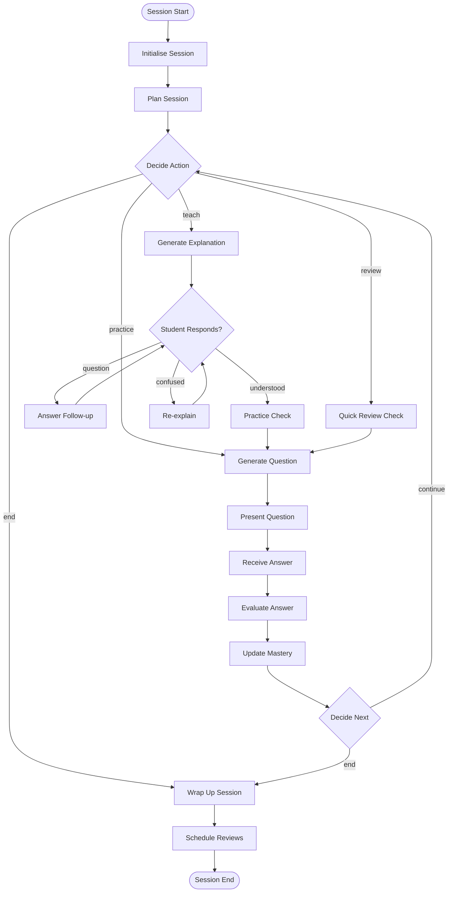

# AI System Design — School in a Box

> **Version:** 0.1.0-draft  
> **Last updated:** 2026-09-17  
> **Status:** Pre-implementation / Architecture Phase

---

## 1. AI System Overview

School in a Box uses AI in four distinct capacities:

| Capacity | Purpose | Latency Requirement | Stateful? |
|---|---|---|---|
| **Tutor** | Generate explanations, analogies, Socratic dialogue | Streaming, first token < 1s | Session-scoped |
| **Assessment Engine** | Generate questions, evaluate answers, detect misconceptions | < 2s per call | Stateless per call |
| **Content Processor** | Extract concepts, build concept graphs, chunk documents | Background (minutes) | Stateless |
| **Learning Orchestrator** | Decide what to do next in a session | < 500ms decision | Session-scoped (LangGraph) |

```
┌─────────────────────────────────────────────────────────┐
│                    AI SYSTEM LAYER                        │
│                                                          │
│  ┌──────────────────────────────────────────────────┐   │
│  │         LLM Client (Provider Abstraction)         │   │
│  │  ┌────────┐  ┌─────────┐  ┌────────┐  ┌───────┐ │   │
│  │  │ OpenAI │  │Anthropic│  │ Ollama │  │ Future│ │   │
│  │  └────────┘  └─────────┘  └────────┘  └───────┘ │   │
│  └──────────────────────┬───────────────────────────┘   │
│                         │                                │
│  ┌──────────┬───────────┼───────────┬──────────────┐    │
│  │          │           │           │              │    │
│  ▼          ▼           ▼           ▼              │    │
│ Tutor    Assessment  Content    Orchestrator       │    │
│ Agent    Engine      Processor  (LangGraph)        │    │
│                                                     │    │
│  ┌──────────────────────────────────────────────┐   │    │
│  │            Prompt Management                  │   │    │
│  │  ┌──────────┐  ┌───────────┐  ┌───────────┐ │   │    │
│  │  │Templates │  │ Versioning│  │ Variables │ │   │    │
│  │  └──────────┘  └───────────┘  └───────────┘ │   │    │
│  └──────────────────────────────────────────────┘   │    │
│                                                      │    │
│  ┌──────────────────────────────────────────────┐   │    │
│  │         AI Observability                      │   │    │
│  │  ┌──────────┐  ┌───────────┐  ┌───────────┐ │   │    │
│  │  │ Tracing  │  │   Cost    │  │  Latency  │ │   │    │
│  │  └──────────┘  └───────────┘  └───────────┘ │   │    │
│  └──────────────────────────────────────────────┘   │    │
└─────────────────────────────────────────────────────┘    │
```

---

## 2. LLM Client Architecture

### 2.1 Provider Abstraction

```python
from abc import ABC, abstractmethod
from typing import AsyncIterator
from pydantic import BaseModel

class LLMMessage(BaseModel):
    role: str  # "system" | "user" | "assistant"
    content: str

class LLMResponse(BaseModel):
    content: str
    model: str
    input_tokens: int
    output_tokens: int
    latency_ms: int
    provider: str

class LLMClient(ABC):
    """Provider-agnostic LLM interface."""

    @abstractmethod
    async def complete(
        self,
        messages: list[LLMMessage],
        model: str,
        temperature: float = 0.7,
        max_tokens: int = 2000,
        response_format: dict | None = None,  # JSON mode
    ) -> LLMResponse:
        ...

    @abstractmethod
    async def stream(
        self,
        messages: list[LLMMessage],
        model: str,
        temperature: float = 0.7,
        max_tokens: int = 2000,
    ) -> AsyncIterator[str]:
        ...
```

### 2.2 Model Configuration

Each AI task has its own model configuration, loaded from environment or config file:

```yaml
ai:
  tasks:
    tutor_explanation:
      provider: openai
      model: gpt-4o
      temperature: 0.7
      max_tokens: 2000
      streaming: true
    
    question_generation:
      provider: openai
      model: gpt-4o-mini
      temperature: 0.8
      max_tokens: 1000
      response_format: json
    
    answer_evaluation:
      provider: openai
      model: gpt-4o-mini
      temperature: 0.2
      max_tokens: 800
      response_format: json
    
    misconception_detection:
      provider: openai
      model: gpt-4o
      temperature: 0.3
      max_tokens: 500
      response_format: json
    
    concept_extraction:
      provider: openai
      model: gpt-4o
      temperature: 0.3
      max_tokens: 2000
      response_format: json
    
    session_summary:
      provider: openai
      model: gpt-4o-mini
      temperature: 0.5
      max_tokens: 500
    
    embedding:
      provider: openai
      model: text-embedding-3-small
      dimensions: 1536
```

### 2.3 Cost Tracking

Every LLM call is wrapped in a cost-tracking decorator:

```python
async def tracked_llm_call(
    client: LLMClient,
    task_purpose: str,
    trace_id: str,
    user_id: str,
    messages: list[LLMMessage],
    **kwargs,
) -> LLMResponse:
    """Wraps LLM call with observability."""
    start = time.monotonic()
    response = await client.complete(messages, **kwargs)
    latency_ms = int((time.monotonic() - start) * 1000)
    
    # Log AIInteraction
    await log_ai_interaction(
        trace_id=trace_id,
        user_id=user_id,
        purpose=task_purpose,
        provider=response.provider,
        model=response.model,
        input_tokens=response.input_tokens,
        output_tokens=response.output_tokens,
        cost_estimate=compute_cost(response),
        latency_ms=latency_ms,
    )
    return response
```

---

## 3. Tutor Agent

### 3.1 Responsibilities
- Generate concept explanations adapted to student level.
- Produce worked examples with step-by-step reasoning.
- Create analogies and visual descriptions.
- Conduct Socratic dialogue (ask leading questions instead of giving answers directly).
- Respond to student follow-up questions with context.

### 3.2 Context Assembly

The Tutor receives a rich context window:

```
┌─────────────────────────────────────────┐
│           TUTOR CONTEXT                  │
│                                          │
│  1. System prompt (tutor persona)        │
│  2. Student profile                      │
│     - Grade level / difficulty band      │
│     - Learning preferences               │
│     - Known misconceptions               │
│  3. Concept details                      │
│     - Name, description                  │
│     - Prerequisites (with mastery)       │
│     - Related concepts                   │
│  4. Retrieved content                    │
│     - Relevant DocumentSections          │
│     - (from vector + keyword search)     │
│  5. Session history                      │
│     - Recent events in this session      │
│     - Previous attempts on this concept  │
│  6. Mastery context                      │
│     - Current mastery level              │
│     - Recent performance trajectory      │
└─────────────────────────────────────────┘
```

### 3.3 Prompt Strategy

| Scenario | Prompt Template | Key Variables |
|---|---|---|
| First introduction | `explain_concept_intro` | concept, prerequisites, student_level, content_snippets |
| Re-explanation (after failure) | `explain_concept_retry` | concept, student_level, previous_explanation, student_error, content_snippets |
| Worked example | `worked_example` | concept, difficulty, content_snippets |
| Socratic dialogue | `socratic_question` | concept, student_response, learning_objective |
| Follow-up answer | `followup_response` | concept, student_question, session_history, content_snippets |

### 3.4 Output Format
- Streamed as markdown text.
- May include LaTeX math (delimited by `$...$` or `$$...$$`).
- May include code blocks for programming concepts.
- No raw HTML.

---

## 4. Assessment Engine

### 4.1 Question Generation

```
Input:
  - concept (with description and content snippets)
  - target_difficulty (0.0 – 1.0)
  - question_type (mcq | short_answer | true_false | worked_problem | open_ended)
  - student mastery history (to avoid repeating identical questions)
  - count (number of questions to generate)

Output (structured JSON):
  - questions: [
      {
        "content": "What is the derivative of x²?",
        "type": "short_answer",
        "difficulty": 0.3,
        "correct_answer": "2x",
        "explanation": "Using the power rule...",
        "distractors": [...],  // for MCQ
        "hints": ["Think about the power rule", "..."],
        "concept_id": "...",
        "misconceptions_tested": ["believes_derivative_is_exponent"]
      }
    ]
```

### 4.2 Answer Evaluation

```
Input:
  - question (with correct answer, concept, type)
  - student_response (raw text)
  - student mastery context

Output (structured JSON):
  {
    "is_correct": false,
    "score": 0.3,  // partial credit
    "explanation": "You applied the right approach but...",
    "misconceptions_detected": [
      {
        "misconception_name": "sign_error_in_differentiation",
        "confidence": 0.8,
        "evidence": "Student wrote -2x instead of 2x"
      }
    ],
    "mastery_delta": -0.05,
    "follow_up_suggestion": "review_with_simpler_example"
  }
```

### 4.3 Difficulty Calibration

The target difficulty for questions is computed as:

```
target_difficulty = f(
    student_mastery,      # Higher mastery → harder questions
    concept_difficulty,   # Inherent difficulty of the concept
    recent_performance,   # Trending up → increase; trending down → decrease
    session_mode          # REVIEW mode → slightly easier; PRACTICE → zone of proximal development
)

# Zone of Proximal Development targeting:
# Aim for ~70% expected success rate (challenging but achievable)
target_difficulty = student_mastery * 0.7 + concept_difficulty * 0.3
# Adjusted by ±0.1 based on recent_performance trend
```

---

## 5. Content Processing Pipeline

### 5.1 Document Ingestion

```
┌──────────┐     ┌──────────┐     ┌──────────────┐     ┌─────────────┐
│  Upload  │────▶│  Extract  │────▶│   Semantic    │────▶│   Concept   │
│  (S3)    │     │  Text     │     │   Chunking    │     │ Extraction  │
└──────────┘     └──────────┘     └──────────────┘     └──────┬──────┘
                                                              │
                ┌──────────────┐     ┌──────────────┐         │
                │  Build/Update│◀────│ Relationship  │◀────────┘
                │ Concept Graph│     │  Detection    │
                └──────┬───────┘     └──────────────┘
                       │
                ┌──────▼───────┐
                │  Generate    │
                │  Embeddings  │──────▶ Qdrant
                └──────────────┘
```

### 5.2 Concept Extraction Prompt

```
Given the following text chunk from a learning material:

---
{chunk_text}
---

Subject context: {subject_name}
Course context: {course_name}

Extract the key learning concepts from this text. Each concept should be:
- Assessable: You can write a question to test this concept
- Teachable: You can explain it in 2-5 minutes
- Distinguishable: It is meaningfully different from other concepts

For each concept, provide:
1. name: A concise name (3-8 words)
2. description: A one-paragraph description
3. prerequisites: Concepts that should be understood first
4. difficulty_estimate: low | medium | high
5. relationships: Related concepts and relationship type

Return as JSON array.
```

### 5.3 Semantic Chunking Strategy

- **Primary method:** Recursive character splitting with semantic boundaries (paragraphs, sections, headers).
- **Chunk size:** 500–1000 tokens (configurable).
- **Overlap:** 100 tokens between chunks.
- **Metadata preserved:** Document ID, page number, section header, position index.
- **Special handling:** Tables, equations, and code blocks are kept intact (not split mid-element).

---

## 6. Learning Orchestrator (LangGraph Workflow)

### 6.1 Workflow Graph



### 6.2 Workflow State

```python
from typing import TypedDict, Literal

class SessionState(TypedDict):
    # Identity
    session_id: str
    user_id: str
    
    # Objective
    learning_goal_id: str | None
    target_concepts: list[str]  # concept IDs
    current_concept_id: str | None
    
    # Progress
    concepts_covered: list[str]
    concepts_remaining: list[str]
    mastery_updates: list[dict]
    misconceptions_found: list[dict]
    
    # Session control
    session_type: Literal["teach", "practice", "review", "mixed"]
    action_history: list[str]
    current_action: str
    interaction_count: int
    max_interactions: int
    
    # Context
    retrieved_content: list[dict]
    student_profile: dict
    mastery_snapshot: dict  # concept_id → mastery_level
    
    # Conversation
    messages: list[dict]  # tutor-student message history
    
    # Metadata
    started_at: str
    time_budget_minutes: int
```

### 6.3 Decision Logic — What to Do Next

The `DECIDE_NEXT` node uses a combination of rules and LLM reasoning:

```python
def decide_next_action(state: SessionState) -> str:
    # Rule-based checks first
    if state["interaction_count"] >= state["max_interactions"]:
        return "end"
    if elapsed_time(state) >= state["time_budget_minutes"]:
        return "end"
    
    current_mastery = state["mastery_snapshot"].get(state["current_concept_id"], 0)
    
    # If just failed badly, re-explain
    if last_score(state) < 0.3 and state["current_action"] == "practice":
        return "explain"
    
    # If mastery is sufficient, move to next concept
    if current_mastery >= MASTERY_THRESHOLD:
        if state["concepts_remaining"]:
            state["current_concept_id"] = state["concepts_remaining"].pop(0)
            return decide_initial_action(state)
        return "end"
    
    # Alternate between explain and practice
    if state["current_action"] == "explain":
        return "practice"
    if state["current_action"] == "practice" and last_score(state) >= 0.7:
        # Got it right, try harder or move on
        return "practice"  # with increased difficulty
    
    return "explain"  # default: re-teach
```

---

## 7. Prompt Management

### 7.1 Prompt Template System

```
prompts/
├── tutor/
│   ├── system.md              # Tutor persona and instructions
│   ├── explain_concept.md     # Initial explanation
│   ├── re_explain.md          # After student confusion
│   ├── worked_example.md      # Step-by-step example
│   ├── socratic.md            # Guided discovery
│   └── followup.md            # Answer follow-up question
├── assessment/
│   ├── generate_question.md   # Question generation
│   ├── evaluate_answer.md     # Answer evaluation
│   └── detect_misconception.md
├── content/
│   ├── extract_concepts.md    # Concept extraction from text
│   ├── build_relationships.md # Concept relationship detection
│   └── summarise_chunk.md     # Chunk summarisation
└── session/
    ├── plan_session.md        # Session planning
    ├── decide_next.md         # Next action decision (when rules are insufficient)
    └── summarise_session.md   # End-of-session summary
```

### 7.2 Prompt Versioning

- Prompts are stored as markdown files in the codebase.
- Each prompt has a version comment at the top: `<!-- version: 1.2 -->`.
- Prompt changes are tracked via git.
- Future: A/B testing framework for prompt variants.

### 7.3 Template Variables

All prompts use Jinja2-style templating:

```markdown
You are a patient, encouraging tutor helping a {{ student_level }} student 
understand {{ concept_name }}.

The student's current mastery of this concept is {{ mastery_level }} 
({{ mastery_label }}).


The student has already learned these prerequisite concepts:

- {{ prereq.name }} (mastery: {{ prereq.mastery_level }})




The student has these known misconceptions to watch for:

- {{ m.name }}: {{ m.description }}



Relevant learning material:
---
{{ content_snippets }}
---

{{ instruction }}
```

---

## 8. Safety & Guardrails

### 8.1 Content Safety
- All LLM outputs are checked for inappropriate content before delivery to the student.
- System prompts include explicit instructions to stay on-topic (educational content only).
- No generation of content unrelated to the student's uploaded material and curriculum.

### 8.2 Pedagogical Safety
- The system never tells a student they are "wrong" harshly; it uses growth-oriented language.
- Misconception detection is non-judgmental ("I notice you might be thinking X, let's explore why Y").
- Difficulty adaptation prevents frustration spirals (reduces difficulty after consecutive failures).

### 8.3 Cost Safety
- Per-user daily LLM cost budget (configurable).
- Per-session token budget (configurable).
- If budget is exceeded, the system gracefully ends the session with a message.
- Cost tracking via `AIInteraction` records.

### 8.4 Hallucination Mitigation
- Tutor explanations are grounded in retrieved content (RAG).
- Questions are generated from specific content snippets, not pure generation.
- Answer evaluation references the original question and correct answer.
- If the system cannot find relevant content, it says so rather than fabricating.

---

## 9. AI Observability

### 9.1 What We Track

| Metric | Granularity | Purpose |
|---|---|---|
| LLM latency | Per call | Performance monitoring |
| Token usage (input/output) | Per call | Cost tracking |
| Cost estimate | Per call, per session, per user/day | Budget enforcement |
| Model used | Per call | Audit, A/B testing |
| Prompt version | Per call | Prompt regression detection |
| Evaluation accuracy | Per assessment | Quality monitoring |
| Misconception detection rate | Per session | Pedagogical effectiveness |
| Mastery prediction accuracy | Periodic calibration | Model quality |

### 9.2 AI Trace Structure

```
AITrace (operation: "session_explain_concept")
├── AIInteraction (purpose: "retrieve_content", model: "text-embedding-3-small")
├── AIInteraction (purpose: "generate_explanation", model: "gpt-4o")
└── AIInteraction (purpose: "log_structured_output", model: null)  // no LLM, just parsing

AITrace (operation: "session_practice_question")
├── AIInteraction (purpose: "generate_question", model: "gpt-4o-mini")
├── AIInteraction (purpose: "evaluate_answer", model: "gpt-4o-mini")
└── AIInteraction (purpose: "detect_misconception", model: "gpt-4o")
```
