# Domain Model — School in a Box

> **Version:** 0.1.0-draft  
> **Last updated:** 2026-09-17  
> **Status:** Pre-implementation / Architecture Phase

---

## 1. Domain Model Diagram

```mermaid
erDiagram
    User ||--|| StudentProfile : has
    User ||--o{ Document : uploads
    User ||--o{ LearningGoal : creates
    User ||--o{ LearningSession : participates_in
    User ||--o{ StudyPlan : has

    StudentProfile {
        uuid id PK
        uuid user_id FK
        string grade_level
        string difficulty_band
        string language
        string timezone
        json preferences
        json cumulative_stats
        string onboarding_state
        timestamp created_at
        timestamp updated_at
    }

    LearningGoal ||--o{ Subject : targets
    LearningGoal ||--o{ Concept : targets
    LearningGoal {
        uuid id PK
        uuid user_id FK
        string title
        string description
        string goal_type
        date target_date
        string status
        json metadata
        timestamp created_at
        timestamp updated_at
    }

    Subject ||--o{ Course : contains
    Subject {
        uuid id PK
        uuid user_id FK
        string name
        string description
        timestamp created_at
    }

    Course ||--o{ Chapter : contains
    Course {
        uuid id PK
        uuid subject_id FK
        string name
        string description
        int sort_order
        timestamp created_at
    }

    Chapter ||--o{ Section : contains
    Chapter ||--o{ Concept : covers
    Chapter {
        uuid id PK
        uuid course_id FK
        string name
        string description
        int sort_order
        timestamp created_at
    }

    Section ||--o{ Concept : covers
    Section {
        uuid id PK
        uuid chapter_id FK
        string name
        string description
        int sort_order
        timestamp created_at
    }

    Concept ||--o{ ConceptRelationship : has_outgoing
    Concept ||--o{ ConceptRelationship : has_incoming
    Concept ||--o{ DocumentSection : referenced_in
    Concept ||--o{ Question : tested_by
    Concept ||--o{ StudentConceptMastery : tracked_by
    Concept ||--o{ Misconception : associated_with
    Concept {
        uuid id PK
        uuid user_id FK
        string name
        string description
        string difficulty_estimate
        uuid section_id FK
        uuid chapter_id FK
        json metadata
        timestamp created_at
    }

    ConceptRelationship {
        uuid id PK
        uuid source_concept_id FK
        uuid target_concept_id FK
        string relationship_type
        float strength
        timestamp created_at
    }

    Document ||--o{ DocumentSection : split_into
    Document {
        uuid id PK
        uuid user_id FK
        string title
        string source_filename
        string mime_type
        string s3_key
        string processing_status
        json processing_metadata
        timestamp uploaded_at
        timestamp processed_at
    }

    DocumentSection {
        uuid id PK
        uuid document_id FK
        int section_index
        text content
        string embedding_id
        json metadata
        timestamp created_at
    }

    LearningSession ||--o{ SessionEvent : contains
    LearningSession {
        uuid id PK
        uuid user_id FK
        uuid learning_goal_id FK
        string session_type
        string status
        json objective
        json summary
        timestamp started_at
        timestamp ended_at
        json metadata
    }

    SessionEvent {
        uuid id PK
        uuid session_id FK
        int event_index
        string event_type
        json payload
        uuid concept_id FK
        timestamp created_at
    }

    Question ||--o{ QuestionAttempt : answered_by
    Question {
        uuid id PK
        uuid concept_id FK
        uuid user_id FK
        string question_type
        float difficulty
        text content
        json options
        json correct_answer
        json metadata
        timestamp created_at
    }

    QuestionAttempt {
        uuid id PK
        uuid question_id FK
        uuid user_id FK
        uuid session_id FK
        text student_response
        boolean is_correct
        float score
        json ai_evaluation
        json misconceptions_detected
        int time_taken_seconds
        float mastery_delta
        timestamp attempted_at
    }

    Misconception ||--o{ StudentMisconception : instance_of
    Misconception {
        uuid id PK
        string name
        text description
        uuid concept_id FK
        json indicators
        json remediation_hints
        timestamp created_at
    }

    StudentMisconception {
        uuid id PK
        uuid user_id FK
        uuid misconception_id FK
        string status
        json evidence
        timestamp detected_at
        timestamp resolved_at
    }

    StudentConceptMastery {
        uuid id PK
        uuid user_id FK
        uuid concept_id FK
        float mastery_level
        float confidence
        int attempt_count
        int correct_count
        int streak
        float ease_factor
        float interval_days
        int repetition_count
        timestamp last_assessed_at
        timestamp next_review_at
        json history
        timestamp created_at
        timestamp updated_at
    }

    StudyPlan ||--o{ ReviewItem : contains
    StudyPlan {
        uuid id PK
        uuid user_id FK
        uuid learning_goal_id FK
        string status
        json generation_metadata
        timestamp generated_at
        timestamp valid_until
    }

    ReviewItem {
        uuid id PK
        uuid study_plan_id FK
        uuid concept_id FK
        date scheduled_date
        float priority
        string status
        timestamp completed_at
    }

    AIInteraction {
        uuid id PK
        uuid trace_id FK
        uuid user_id FK
        string purpose
        string provider
        string model
        text prompt_hash
        text response_hash
        int input_tokens
        int output_tokens
        float cost_estimate
        int latency_ms
        json metadata
        timestamp created_at
    }

    AITrace ||--o{ AIInteraction : contains
    AITrace {
        uuid id PK
        uuid user_id FK
        uuid session_id FK
        string operation
        string status
        timestamp started_at
        timestamp completed_at
        json metadata
    }
```



---

## 2. Aggregate Boundaries

Domain-Driven Design aggregates define transactional consistency boundaries.

### Aggregate 1: User Aggregate
- **Root:** `User`
- **Members:** `StudentProfile`
- **Invariant:** One profile per user.

### Aggregate 2: Curriculum Aggregate
- **Root:** `Subject`
- **Members:** `Course`, `Chapter`, `Section`
- **Invariant:** Hierarchical ordering is maintained (Subject → Course → Chapter → Section).

### Aggregate 3: Concept Graph Aggregate
- **Root:** `Concept`
- **Members:** `ConceptRelationship`
- **Invariant:** No circular prerequisite chains. Relationship types are from a controlled vocabulary.

### Aggregate 4: Content Aggregate
- **Root:** `Document`
- **Members:** `DocumentSection`
- **Invariant:** Sections are ordered. Processing status transitions are valid (pending → processing → ready | failed).

### Aggregate 5: Session Aggregate
- **Root:** `LearningSession`
- **Members:** `SessionEvent`
- **Invariant:** Events are ordered. Session state transitions follow the defined state machine.

### Aggregate 6: Assessment Aggregate
- **Root:** `Question`
- **Members:** `QuestionAttempt`
- **Invariant:** A question attempt references a valid question and user.

### Aggregate 7: Mastery Aggregate
- **Root:** `StudentConceptMastery`
- **Members:** (standalone per user-concept pair)
- **Invariant:** One mastery record per (user, concept) pair. Mastery level ∈ [0.0, 1.0].

### Aggregate 8: Misconception Aggregate
- **Root:** `Misconception`
- **Members:** `StudentMisconception`
- **Invariant:** Status transitions: `active` → `resolved` → `recurring` → `resolved`.

### Aggregate 9: Study Plan Aggregate
- **Root:** `StudyPlan`
- **Members:** `ReviewItem`
- **Invariant:** Review items are ordered by scheduled date. Only one active study plan per goal.

### Aggregate 10: AI Observability Aggregate
- **Root:** `AITrace`
- **Members:** `AIInteraction`
- **Invariant:** Interactions are ordered within a trace. Cost and token counts are non-negative.

---

## 3. Entity Lifecycle States

### 3.1 Document Processing Status

```
┌─────────┐     ┌────────────┐     ┌───────┐
│ PENDING  │────▶│ PROCESSING │────▶│ READY │
└─────────┘     └─────┬──────┘     └───────┘
                      │
                      ▼
                ┌──────────┐
                │  FAILED  │
                └──────────┘
```

### 3.2 Learning Session Status

```
┌─────────────┐     ┌──────────┐     ┌───────────┐
│ INITIALISING│────▶│  ACTIVE  │────▶│ COMPLETED │
└─────────────┘     └────┬─────┘     └───────────┘
                         │
                    ┌────▼─────┐
                    │ PAUSED   │──── (can resume to ACTIVE)
                    └────┬─────┘
                         │
                    ┌────▼──────┐
                    │ ABANDONED │
                    └───────────┘
```

### 3.3 Learning Goal Status

```
┌─────────┐     ┌──────────┐     ┌───────────┐
│  DRAFT  │────▶│  ACTIVE  │────▶│ COMPLETED │
└─────────┘     └────┬─────┘     └───────────┘
                     │
                ┌────▼──────┐
                │  PAUSED   │
                └────┬──────┘
                     │
                ┌────▼───────┐
                │ ABANDONED  │
                └────────────┘
```

### 3.4 Review Item Status

```
┌─────────┐                  ┌───────────┐
│ PENDING │─── (date passes) ──▶│  OVERDUE  │
└────┬────┘                  └─────┬─────┘
     │                              │
     ▼                              ▼
┌───────────┐              ┌───────────┐
│ COMPLETED │              │  SKIPPED  │
└───────────┘              └───────────┘
```

### 3.5 Student Misconception Status

```
┌────────┐     ┌──────────┐     ┌───────────┐
│ ACTIVE │────▶│ RESOLVED │────▶│ RECURRING │
└────────┘     └──────────┘     └─────┬─────┘
                                      │
                                      ▼
                                ┌──────────┐
                                │ RESOLVED │
                                └──────────┘
```

---

## 4. Key Domain Rules

1. **Mastery is always per (user, concept).** There is exactly one `StudentConceptMastery` record per user-concept pair.

2. **Concepts can exist without documents.** A concept can be manually created or extracted from multiple documents.

3. **Questions are always linked to at least one concept.** This ensures every assessment contributes to mastery tracking.

4. **Session events are append-only.** Once created, session events are never modified or deleted.

5. **Study plans are regenerative.** A new study plan replaces the old one; history is preserved via timestamps.

6. **Prerequisite relationships form a DAG.** Circular prerequisite chains are invalid and must be detected and rejected.

7. **AI interactions are immutable.** Once logged, AI interaction records are never modified.

8. **User data is isolated.** A user can only access their own data. There are no cross-user queries in the MVP.

---

## 5. Value Objects

These are not persisted as separate entities but are embedded as JSON or computed.

| Value Object | Used In | Description |
|---|---|---|
| `MasteryLevel` | `StudentConceptMastery` | Float [0.0, 1.0] with semantic labels: `novice` (0–0.2), `beginner` (0.2–0.4), `intermediate` (0.4–0.6), `proficient` (0.6–0.8), `mastered` (0.8–1.0) |
| `DifficultyLevel` | `Question`, `Concept` | Float [0.0, 1.0] representing question or concept difficulty |
| `ReviewSchedule` | `StudentConceptMastery` | Computed: next review date, interval, ease factor |
| `SessionObjective` | `LearningSession` | JSON: target concepts, goal reference, session type preference |
| `EvaluationResult` | `QuestionAttempt` | JSON: correctness, score, explanation, misconceptions detected |
| `ConceptPath` | Computed | An ordered list of concepts forming a learning path from prerequisites to target |
