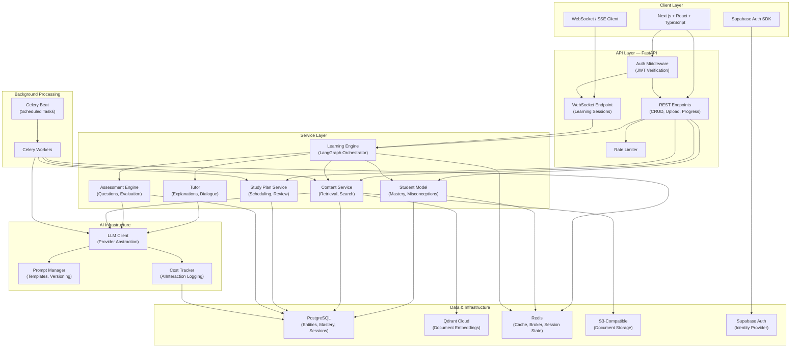
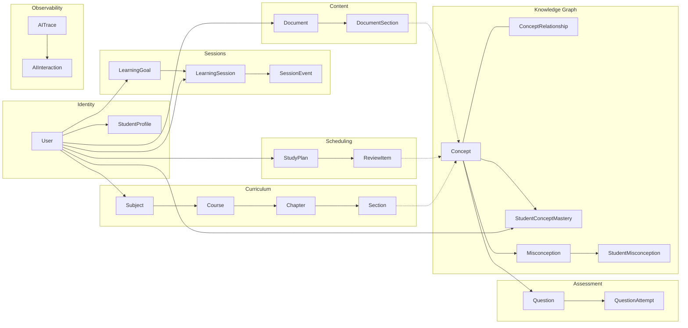
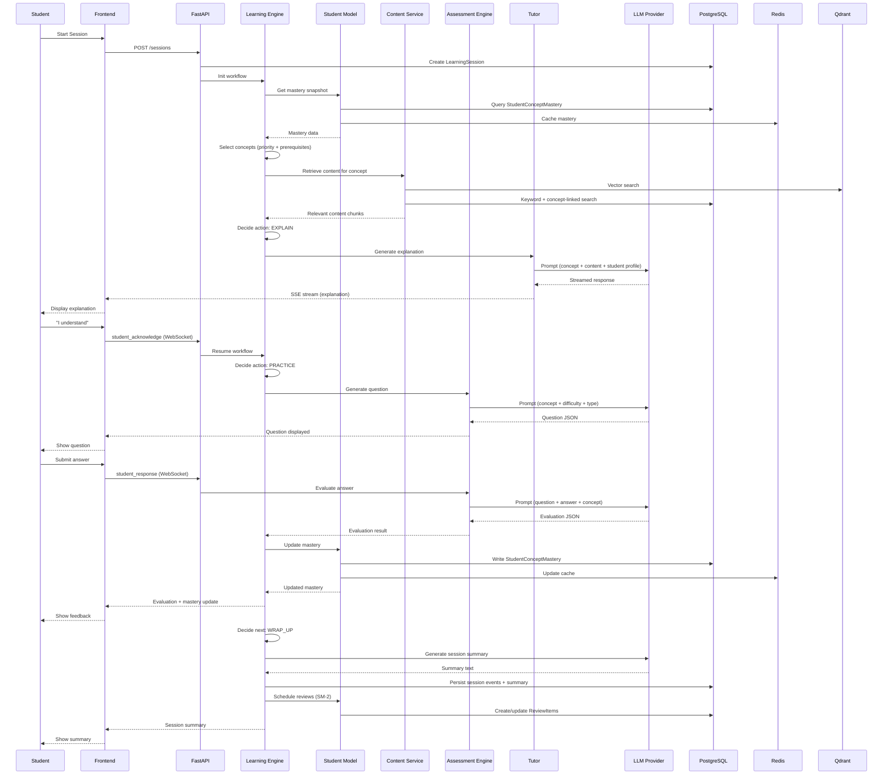
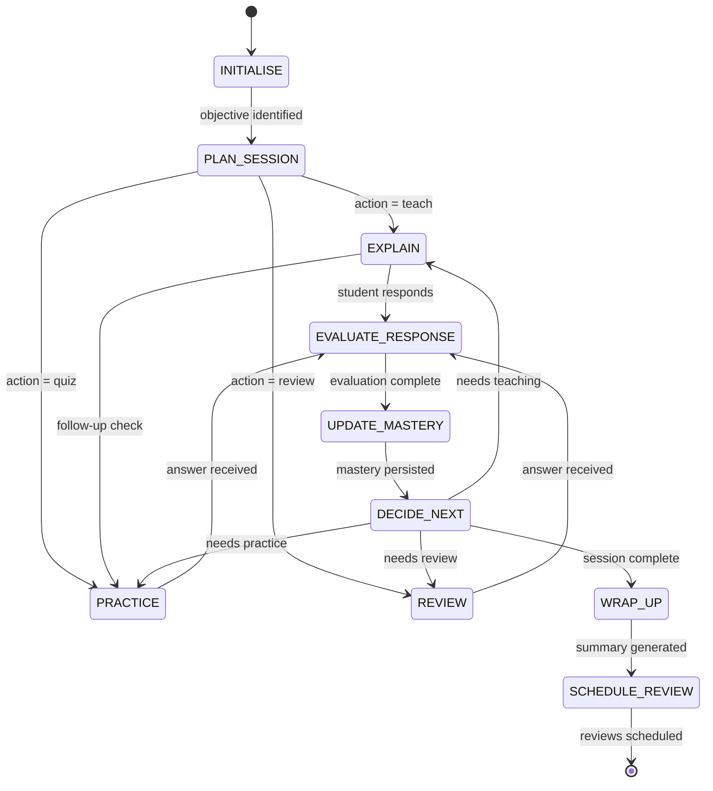

# School in a Box — Phase 1 Deliverable Summary

> Architecture & Contracts Phase Complete

---

## Architecture Diagram

---

## Domain Model Diagram

---

## Data Flow Diagram — Learning Session

---

## AI Workflow Diagram

---

## Unresolved Product Assumptions

| # | Assumption | Impact | Proposed Default | Decision Deadline |
|---|---|---|---|---|
| 1 | **Concept granularity** — How fine-grained should AI extraction be? | Affects extraction prompts, mastery tracking precision | "Assessable and teachable in 2–5 minutes" | Phase 3 start |
| 2 | **Mastery "learned" threshold** — 0.80 or different? | Affects when concepts transition to review mode | 0.80 | Phase 4 start |
| 3 | **Session duration** — Fixed or student-adjustable? | Affects UX, fatigue management, cost | Default 30 min, adjustable 10–60 min | Phase 5 start |
| 4 | **Content licensing** — Track copyright of uploaded material? | Legal exposure | No; ToS puts responsibility on student | Phase 3 start |
| 5 | **LLM failure fallback** — Graceful degradation or hard stop? | Reliability during outages | End session with message; no degraded mode in MVP | Phase 4 start |
| 6 | **Pre-built concept graphs** — Seed common subjects? | Cold-start quality for new users | No; derive everything from uploaded material | Phase 3 start |
| 7 | **Multi-document concept merging** — How to deduplicate concepts from different uploads? | Concept graph quality | LLM-assisted deduplication on extraction | Phase 3 |
| 8 | **Cost per session target** — Is $0.10 average realistic? | Model selection, session length | Target $0.10; monitor and adjust model/prompt | Phase 4 |
| 9 | **Question persistence** — Store and reuse generated questions? | Quality consistency vs. freshness | Store and reuse; allow regeneration | Phase 4 |
| 10 | **Mastery decay aggressiveness** — How fast does mastery fade? | Review scheduling pressure | Conservative: `ease_factor × 10` stability constant | Phase 6 |

---

## Proposed Repository Structure

See [DEVELOPMENT_PHASES.md → Proposed Repository Structure](file:///e:/PrepBud/docs/DEVELOPMENT_PHASES.md) for the full tree.

**Summary:**
- `docs/` — 11 architecture documents (this phase)
- `backend/` — FastAPI app with modular service architecture
- `frontend/` — Next.js App Router with TypeScript
- `docker-compose.yml` — Local dev infrastructure
- `.github/workflows/` — CI/CD pipelines

---

## Phase 2 Acceptance Criteria

| ID | Criterion | Verification |
|---|---|---|
| **AC-2.1** | User can sign up via Supabase Auth and `User` + `StudentProfile` records are created in PostgreSQL on first API call | Integration test |
| **AC-2.2** | All CRUD endpoints return correct data, scoped to the authenticated user | Integration test |
| **AC-2.3** | Accessing another user's resources returns 404 (not 403) | Integration test |
| **AC-2.4** | Requests without a valid JWT return 401 | Integration test |
| **AC-2.5** | Database schema matches `DATA_MODEL.md` — all tables created via Alembic migration | Migration run + schema comparison |
| **AC-2.6** | `GET /health` returns service status including database connectivity | Manual + integration test |
| **AC-2.7** | Frontend displays login page, authenticates, and renders a dashboard skeleton | E2E test / manual |
| **AC-2.8** | Docker Compose starts all local dependencies with a single command | Manual verification |
| **AC-2.9** | CI pipeline passes: linting, type checking, and all tests green | CI run |
| **AC-2.10** | Test coverage for backend unit + integration tests ≥ 80% | Coverage report |

---

## Documents Created

| Document | Path | Purpose |
|---|---|---|
| Product Requirements | [PRODUCT_REQUIREMENTS.md](file:///e:/PrepBud/docs/PRODUCT_REQUIREMENTS.md) | Vision, actors, entities, user stories, MVP scope |
| Architecture | [ARCHITECTURE.md](file:///e:/PrepBud/docs/ARCHITECTURE.md) | System components, data flows, tech stack |
| Architecture Decisions | [ARCHITECTURE_DECISIONS.md](file:///e:/PrepBud/docs/ARCHITECTURE_DECISIONS.md) | 11 ADRs with rationale |
| Domain Model | [DOMAIN_MODEL.md](file:///e:/PrepBud/docs/DOMAIN_MODEL.md) | Entities, aggregates, lifecycles, domain rules |
| AI System Design | [AI_SYSTEM_DESIGN.md](file:///e:/PrepBud/docs/AI_SYSTEM_DESIGN.md) | LLM architecture, tutor, assessment, safety |
| Security Model | [SECURITY_MODEL.md](file:///e:/PrepBud/docs/SECURITY_MODEL.md) | Auth, authorization, data security, threats |
| Data Model | [DATA_MODEL.md](file:///e:/PrepBud/docs/DATA_MODEL.md) | PostgreSQL schema, Qdrant, Redis, queries |
| Learning Engine | [LEARNING_ENGINE.md](file:///e:/PrepBud/docs/LEARNING_ENGINE.md) | Mastery algorithms, concept selection, scheduling |
| API Contract | [API_CONTRACT.md](file:///e:/PrepBud/docs/API_CONTRACT.md) | REST + WebSocket endpoints, message protocol |
| Test Strategy | [TEST_STRATEGY.md](file:///e:/PrepBud/docs/TEST_STRATEGY.md) | Test pyramid, AI testing, CI pipeline |
| Development Phases | [DEVELOPMENT_PHASES.md](file:///e:/PrepBud/docs/DEVELOPMENT_PHASES.md) | 8 phases with deliverables and acceptance criteria |
